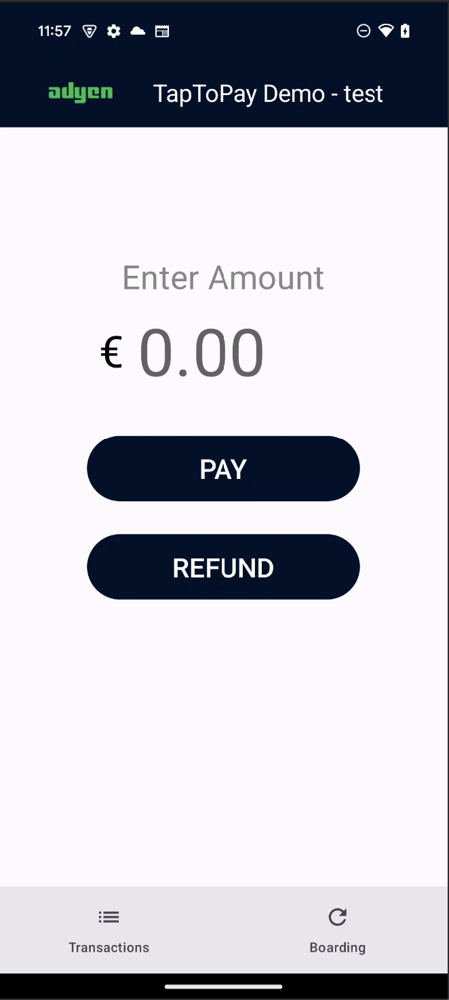
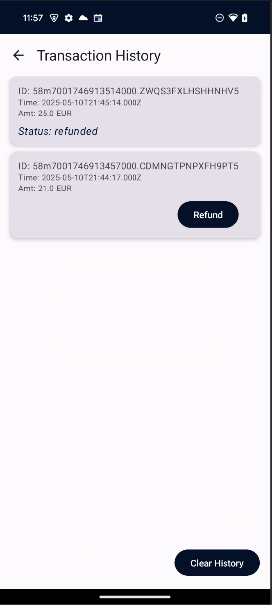

# POS Tap to Pay
## Project Description

This is a demo POS app for Adyen's TapToPay Android solution. It integrates with the Adyen Payments App using an 'Android App Link' for payments. Ensure both this POS Demo app and the Adyen Payments App from the Google Play Store are installed on your device.

 

## How to Run

1. Clone the repository.
2. Open the project in Android Studio.
3. Ensure the `local.properties` file contains your Adyen credentials as described below.
4. Make sure your API credential has a Client key created (this is for Monitoring & Attestation purposes).
5. Make sure your API key has the persmission: Adyen Payments App role (Your Adyen contact can enable this).
6. On your merchant account, set the TFM property androidTapToPay.enable = true (Your Adyen contact can enable this).
7. On your merchant account, under the terminal settings set the Key identifier, key passphrase and key version for the merchant account you are going to use.
8. Build and run the project.

## Local Properties Setup

To run this project, you need to add your Adyen credentials to the `local.properties` file.

1. Open the `local.properties` file (located in the root directory of the project).
2. Copy and paste the key values pair below in `local.properties` file.
3. Set the ENV variable in your local.properties file to "live," "test," or "dev" to specify the Adyen Payments app your are using.
4. Add your credentials as shown here:

ADYEN_API_KEY=your_api_key_here

ADYEN_MERCHANT_ACCOUNT=your_merchant_account_here

KEY_IDENTIFIER=your-key-identifier

PASSPHRASE=your-passphrase

KEY_VERSION=1

ENV=test

APP_LINK_URL=https://www.adyen.com/test

## Notes
- To trigger payments with the PIN, you need to turn off dev mode on the device
- In this demo app, the boarding API call to Adyen is made in data/remote/BoardingRepository.kt, but should ideally be made from a server rather than directly from the app for best practice.
- This app communicates with the secondary Adyen Payments app by opening an Android App Link (deeplink is deprecated). Android uses "intents" to accomplish this. To "whitelist" the different deep links used by the app—both for opening the external app and for handling the return—I have added intent filters in the AndroidManifest.xml for all the different URLs being used. 
- The "Boarding" button visually demonstrates the one-time boarding process. In a real scenario this would run in the background without user interaction.
