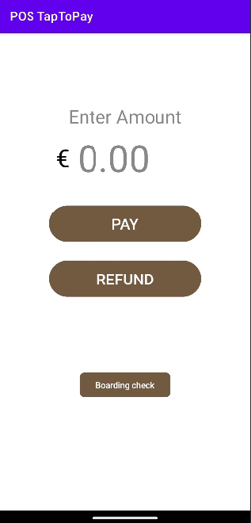

# POS Tap to Pay
## Project Description

This is a demo POS app for Adyen's TapToPay Android solution. It integrates with the Adyen Payments App using a deeplink for payments. Ensure both this POS Demo app and the Adyen Payments App APK are installed on your device.

## How to Run

1. Clone the repository.
2. Open the project in Android Studio.
3. Ensure the `local.properties` file contains your Adyen credentials as described below.
4. Build and run the project.
5. Make sure your API credential also has a Client key created (this is for Monitoring & Attestation purposes)
6. On your merchant account, set the TFM property androidTapToPay.enable = true (Your Adyen contact can enable this)
7. on your API key set the POS permission: Adyen Payments App role(Your Adyen contact can enable this)

## Local Properties Setup

To run this project, you need to add your Adyen credentials to the `local.properties` file.

1. Open the `local.properties` file (located in the root directory of the project).
2. Add your credentials as shown here:

ADYEN_API_KEY=your_api_key_here

ADYEN_MERCHANT_ACCOUNT=your_merchant_account_here

KEY_IDENTIFIER=your-key-identifier

PASSPHRASE=your-passphrase

KEY_VERSION=1

## Notes

- The `local.properties` file should not be included in version control and is listed in `.gitignore`.
- In this demo app, the boarding API call to Adyen is made in data/remote/BoardingRepository.kt, but should ideally be made from a server rather than directly from the app for best practice.